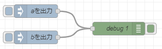

# Node-REDを活用したIoT実習

## Node-REDとは

### 基本ノードについて

#### Injectノード

injectノードは、フローエディタ内で、injectノードのボタンをクリックすることで、手動で以下に構成されたフローを始動させることができる。また、injectノードから送信されるメッセージには、`payload`および`topic`を設定することができる。

<center>
  
</center>

- payloadの型
    - 文字列型
    - 数値型
    - 真理値型
    - バッファ型
    - JSON型
    - 1970年1月1日からミリ秒で表現されるタイムスタンプ型(日時)`(デフォルト)`

- interval
    - 最大596時間(約24日)に設定できる。

#### Debugノード

debugノードは、フローエディタ内のDebugサイドバーにメッセージを表示させることができる。このサイドバーは、送信されたメッセージを構造的な表示を行う。作成したフローが正常に動作しない場合、このノードが必要になる。

<center>
  
</center>

以下のフローで説明をする。この状態で、`aを出力`のinjectノードのボタンをクリックすると、デバッグには、以下の画面が表示される。この表示によると、`msg.payload`に`a`という「String(文字列)」が一つ送られてきたという意味になる。

<center>
  
</center>

<center>
  
</center>

#### メッセージオブジェクトの詳細

メッセージの内容を詳しく知るために、`debugノード`の対象を`msgオブジェクト全体`に変更する。

<center>
  
</center>

再度injectノードのボタンをクリックすると、デバッグメッセージが以下のように表示される。Node-REDでは、ノード間は、このメッセージオブジェクトというオブジェクト`(データの集合体)`が転送されることで動作する仕組みになっている。この表示内容がオブジェクトの中身になります。これによるとオブジェクトは、名称がmsgで、内部が_msgidとtopicとpayloadという三種のキー名によるJSON形式`(JSON:JavaScriptObjectNotationの略「dデータをキー名(key)と値(value)のペアで表現する形式」例：{key1:value1, key2:value2, key3:value3})`となっている。ここでは、実際に_msgidキーとtopicキーは内部で使われている情報で、ノードの動作には、`payloadキー`に格納されている値が使用されている。このpayloadを`「msg.payload」`と表し、Node-REDでは。JSONの中の特定の1項目を指定する場合、キー名に`.(ドット)`で接続して指定する。

<center>
  
</center>

<center>
  
</center>


#### Functionノード

Functionノードは、受け渡されたメッセージに対するJavaScriptのコードを実行し、メッセージを返す。メッセージは、`msg`と呼ばれる一つのオブジェクトとして渡され、メッセージの本体を含む`msg.payload`プロパティを持つ。Functionノードに入力されたコードは。関数に相当し、最も単純な関数は、メッセージを単にそのまま返すコードになります。デフォルトのコードを以下に示す。

```js
return msg;
```

以下のコードは、メッセージを含む`msg.payload`をvalという変数に置き換え、その後、`a`という文字列をくっつけて、再度msg.payloadに代入して、msgというオブジェクトを返しています。

```js
var val = msg.payload;
msg.payload = val + "a";
return msg;
```

#### Changeノード

Changeノードは、メッセージプロパティを変更することができる。

- 値の代入
  
  単純にpayloadのコピーやpayload内のJSONデータの特定のキーや、新しいプロパティを追加して、コピーすることができる。

- 値の置換

  指定した文字列を指定した文字列に置き換える。

- 値の移動と削除

  値の移動は、代入と同じような動作になるが、移動元のデータが削除される。値の削除は、JSONのキーなどの削除ができる。

#### Templateノード

Templateノードは、Web画面を構成するための言語であるHTMLコードを記述したり、あらかじめ決められたメッセージに入力されたデータを埋め込んで出力することができる。Templateノードは、`{{key}}`で囲われた部分が、JSON形式の入力メッセージに応じて内容が代わるメッセージを出力することができます。この書式のことを`「Mustache記法」`と呼ぶ。

```js
This is the payload: {{payload}} !
```