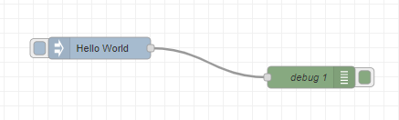

# Node-REDを活用したIoT実習

## Hello Worldを出力

### データフロー

データフローは下図となる．node-red側の`inject`ノードを用いてデータの取得を行う．

  

### 各ノードの設置内容は以下

- inject
  - 名前：`文字を出力`
  - masg.payload=`Hello world`

  

- debug
    - デフォルト

`デプロイ` ボタンをクリックしノードを有効化する

### デバッグを確認

  

### 変更してみる

  

`デプロイ` ボタンをクリックしノードを有効化する。

### （課題）様々なデータを出力

デバッグ画面の`青い`出力文字をクリックすると表示形式が変更される。

- inject
  - 名前：`時間を取得`
    - msg.payload=`日時`
  
  - 名前：`数値を出力`
    - msg.payload=(数値)`100`

  - 名前：`jsonを出力`
    - msg.payload=({})`{"IT":"020500"}`
  

  

