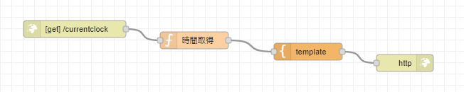

# Node-REDを活用したIoT実習

## HTMLを表示する

### データフロー

データフローは下図となる。

<center>
  
</center>

### 各ノードの設置内容は以下

- http in
    - メソッド：`GET`
    - URL：`/currentclock`
    
- function
    - 名前：`時間取得`
    - コード
    ```javascript
    // 時間の取得
    msg.payload=new Date().toString();
    return msg;
    ```

- template
    - コード
    ```html
    <html>
    <head>
        <title>
            時間のお知らせ
        </title>
    </head>
    <body>
        <h1>時間のお知らせ</h1>
        ただいまの時間は、<b>{{ payload }}</b>です!
    </body>
    </html>
    ```

- http response
    - デフォルト

`デプロイ` ボタンをクリックしノードを有効化する

以下のURL<http://localhost:8080/currentclock>にアクセスする。


## （課題）URLやHTMLを変更して表示してみよう
