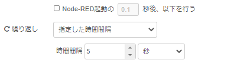
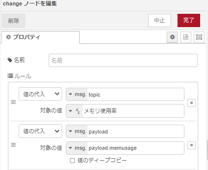

# Node-REDを活用したIoT実習

## ダッシュボードを使う

### データフロー

データフローは下図となる。

  

### node-red ダッシュボード機能

`node-red-dashboard` を利用することで容易にダッシュボードを作成することが可能となる．

### `node-red-dashboard` ノードの追加

パレットの管理から，ノードを追加を選択して，`node-red-dashboard` を検索し追加を行う．

### ダッシュボードの例

次の図は、Node-REDコンテナのメモリ使用率のデータをチャート表示したものである。

    

### `node-red-contrib-os` ノードの追加

パレットの管理から，ノードを追加を選択して，`node-red-contrib-os` を検索し追加を行う．

### 各ノードの設置内容は以下

- inject

  

- Memory
    - デフォルト

- change
    - 値の代入：`msg.topic`
        - 対象の値：(文字列)`メモリ使用率`

    - 値の代入：`msg.payload`
        - 対象の値：`masg.mayload.memusage`

    

- chart
    - Tab：` メモリ使用率 `
    - グループ：` チャート `
    - ラベル：` メモリ使用率 `

    

`デプロイ` ボタンをクリックしノードを有効化する

以下のURL<http://localhost:8080/ui>にアクセスする。

### （課題）全体のメモリと空き容量を追加でチャートにしよう

- change
    - 値の代入：`msg.payload`
        - 対象の値：`masg.mayload.xxxxx`

    

