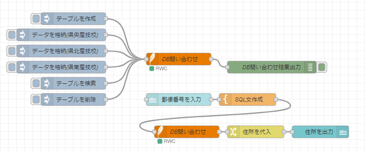
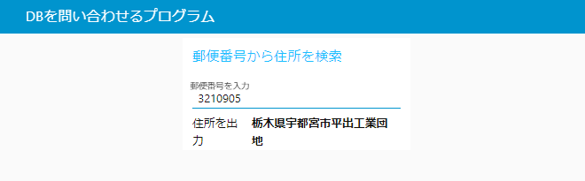
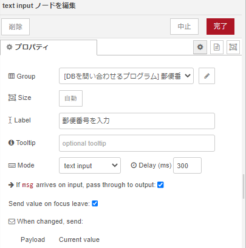
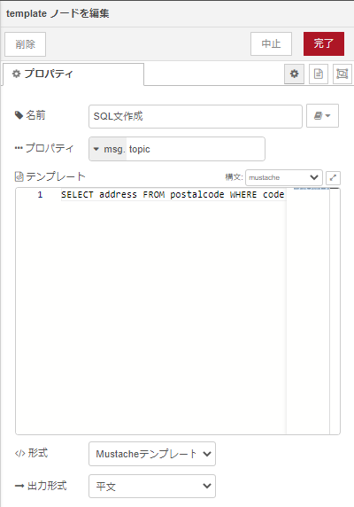
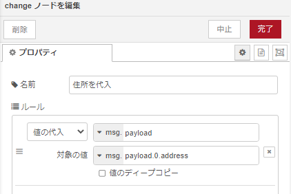

# Node-REDを活用したIoT実習

## データデースを使う

### データフロー

データフローは下図となる。

<center>
  
</center>

### node-red データベース機能

`node-red-node-sqlite` を利用することでDBのサーバを構築することなく手軽に利用することが可能となる。

### `node-red-node-sqlite` ノードの追加

パレットの管理から，ノードを追加を選択して，`node-red-node-sqlite` を検索し追加を行う．


### ダッシュボードの例

次の図は、ダッシュボードから郵便番号を受け付け、住所を表示したものである。

<center>
    
</center>

### 各ノードの設置内容は以下

- inject
    - 名前：` テーブルを作成 `
    - msg.topic=(文字列)`CREATE TABLE postalcode (code INTEGER, address VARCHAR(255));`

- inject
    - 名前：` データを格納(県央産技校) `
    - msg.topic=(文字列)`INSERT INTO postalcode VALUES ('3210905', '栃木県宇都宮市平出工業団地');`

- inject
    - 名前：` データを格納(県北産技校) `
    - msg.topic=(文字列)`INSERT INTO postalcode VALUES ('3250001', '栃木県那須郡那須町大字高久甲');`

- inject
    - 名前：` データを格納(県南産技校) `
    - msg.topic=(文字列)`INSERT INTO postalcode VALUES ('3294214', '栃木県足利市多田木町');`

- inject
    - 名前：` テーブルを検索 `
    - msg.topic=(文字列)`SELECT * FROM postalcode;`

- inject
    - 名前：` テーブルを削除 `
    - msg.topic=(文字列)`DROP TABLE postalcode;`

- sqlite
    - 名前：` DB問い合わせ `
    - データベース
    ```shell
    /data/postalcode.db
    ```

- debug
    - デフォルト

- text input
    - Tab：` DBを問い合わせるプログラム `
    - グループ：` 郵便番号から住所を検索 `
    - Lavel：` 郵便番号を入力 `

<center>
    
</center>

- template
    - 名前：`SQL文作成`
    - テンプレート
    ```shell
    SELECT address FROM postalcode WHERE code = {{payload}};
    ```

<center>
    
</center>

- change
    - 名前：`住所を代入`
    - 値の代入：`msg.payload`
        - 対象の値：`msg.payload.0.address`

<center>
    
</center>

- text
    - Tab：` DBを問い合わせるプログラム `
    - グループ：` 郵便番号から住所を検索 `
    - Lavel：` 住所を出力 `

`デプロイ` ボタンをクリックしノードを有効化する

以下のURL<http://localhost:8080/ui>にアクセスする。

### 様々な住所データを作成しよう
