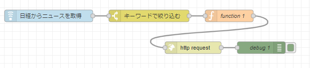
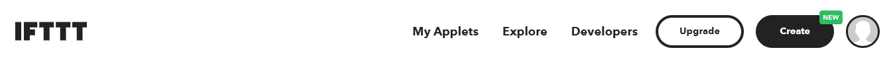
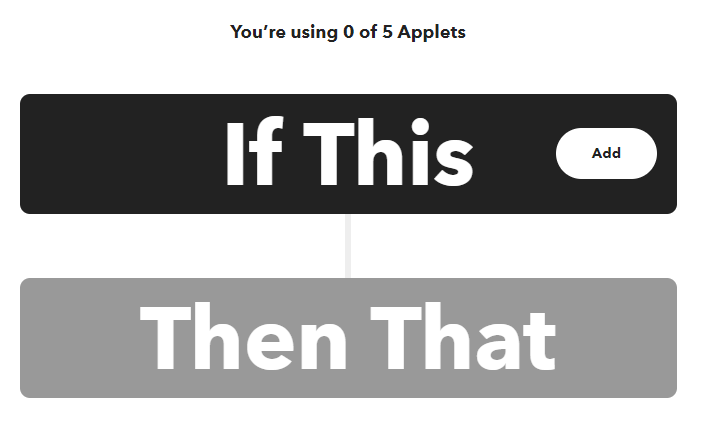
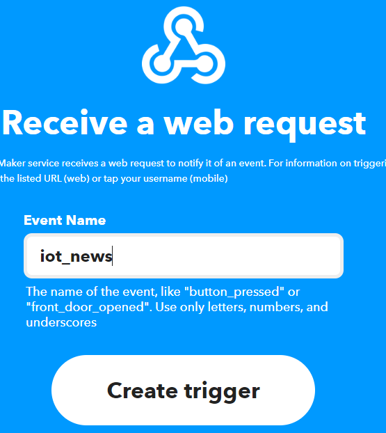
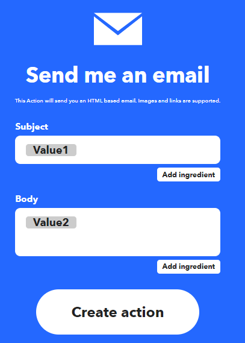
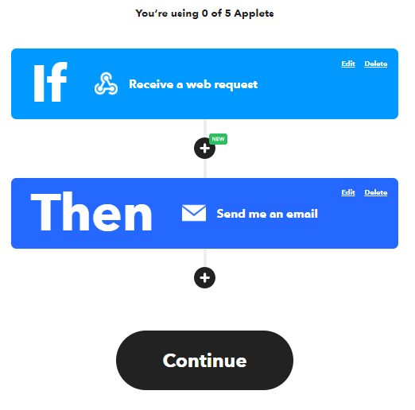
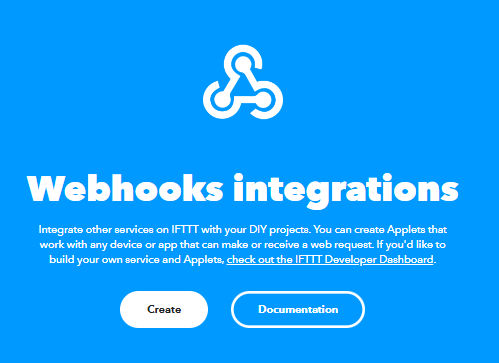
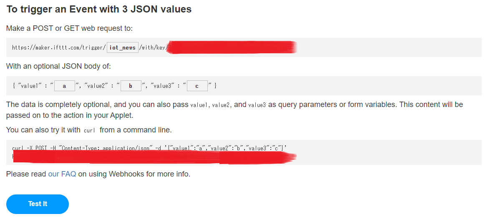
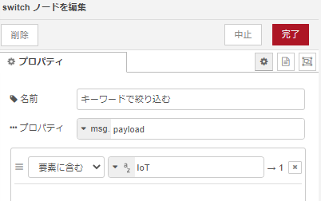

# Node-REDを活用したIoT実習

## IFTTTを使う

IFTTT(イフト)とは、`IF This Then Taht`の略で、Webサービスやアプリケーション同士を連携させることができるサービスであり、LINEやGmail、Twitter等のSNSに連携することができる。無料アカウントでは、最大3つまでアプレットを作成することができる。

### データフロー

データフローは下図となる。

<center>
  
</center>

### node-red フィードパース機能

`node-red-node-feedparser` を利用することでWebサイトの要約が記載されているRSS`(Rich Site Summary:ブログの更新情報を公開すのに使用されている)`からデータを取得するノードである。

### `node-red-node-feedparser` ノードの追加

パレットの管理から，ノードを追加を選択して，`node-red-node-feedparser` を検索し追加を行う。

### IFTTTを使用したメール送信

事前にgoogleアカウント（Gmail）にてIFTTTアカウントを作成してください。

### IFTTTの設定

以下のアドレスにアクセス
  - <https://ifttt.com/explore>

- 手順

  - `Create`をクリック
  <center>
    
  </center>

  - `IF This`のAddをクリックし、`webohok`を選択
  <center>
    
  </center>

  - Receive a web requestを選択し、Event Nameを`iot_news`にし、Create triggerをクリック
  <center>
    
  </center>

  - `Then That`のAddをクリックし、`emailを選択`
  - SubjectとBodyを以下の図と同様にする。
  <center>
    
  </center>

  - `Continue`をクリック
  <center>
    
  </center>

  - `Webhooks`のアイコンをクリックし、`Documentation`をクリック
  <center>
    
  </center>

  - `{{event}}`にiot_newsを入れ、以下のURLをコピーする。
  <center>
    
  </center>

### 各ノードの設置内容は以下

- feedparser
    - 取得先URL：
    ```shell
    https://xtech.nikkei.com/rss/index.rdf
    ```

    - 更新：`1`
    - 名前：`日経からニュースを取得`

- switch
    - 名前：`キーワードで絞り込む`
    - 要素に含む：(文字列)`IoT`

  <center>
    
  </center>

- function
    - 名前：` JSON形式に変換 `
    - コード
    ```js
    var json = { "value1": "日経ニュース", "value2": msg.payload }
    msg.payload= json
    return msg;
    ```

- http request
    - メソッド：` POST `
    - URL：<https://maker.ifttt.com/trigger/iot_news/with/key/xxxxxxxxxxxxxxxxxx>
    - 出力形式：`UTF8文字列`

- debug
    - デフォルト

`デプロイ` ボタンをクリックしノードを有効化する

## (課題)別のキーワードを入れてメールに送ってみよう
