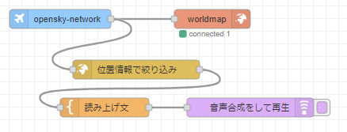

# Node-REDを活用したIoT実習

## worldmapを使う

### データフロー

データフローは下図となる。

  

### node-red ワールドマップ機能

`node-red-contrib-web-worldmap` を利用することで地図を扱いUIを簡単に実装することができる。地図上にマーカを表示する機能を持っています。

### `node-red-contrib-web-worldmap` ノードの追加

パレットの管理から，ノードを追加を選択して，`node-red-contrib-web-worldmap` を検索し追加を行う。

### 地図を表示する

- <http://localhost:8080/worldmap>で地図が表示できます。

### `node-red-contrib-opensky-network` ノードの追加

パレットの管理から，ノードを追加を選択して，`node-red-contrib-opensky-network` を検索し追加を行う。

### `node-red-node-geofence` ノードの追加

パレットの管理から，ノードを追加を選択して，`node-red-node-geofence` を検索し追加を行う。

### `node-red-contrib-play-audio` ノードの追加

パレットの管理から，ノードを追加を選択して，`node-red-contrib-play-audio` を検索し追加を行う。

### 各ノードの設置内容は以下

- worldmap
    - start
        - Latitude:`36.5`
        - Longitude:`139.0`

- opensky-network
    - 経緯（南端）：`20`
    - 経緯（西端）：`122`
    - 経度（北端）：`46`
    - 経度（東端）：`154`

- template
    - 名前：`読み上げ文`
    - テンプレート：`飛行機がもうすぐ来るよ`
    - 形式：`Mustacheテンプレート`
    - 出力形式：`平文`

- play audio
    - TTSボイス：`任意`
    - 名前：`音声合成をして再生`

`デプロイ` ボタンをクリックしノードを有効化する

以下のURL<http://:8080/worldmap>にアクセスする。
