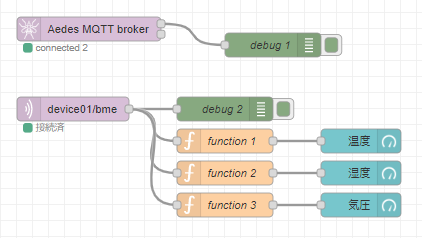
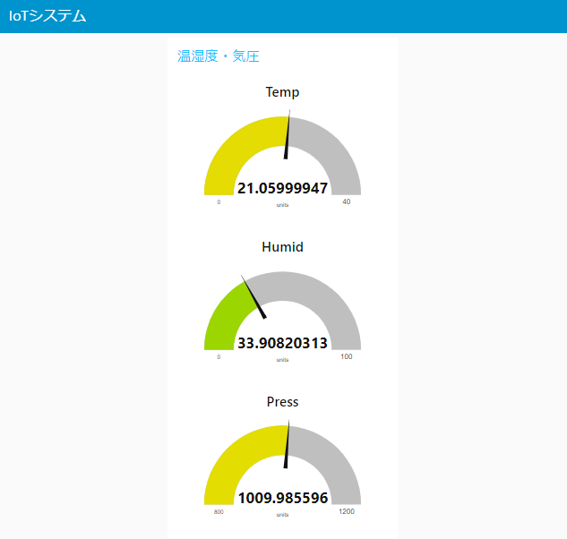
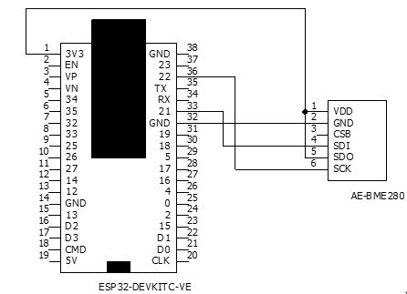

# Node-REDを活用したIoT実習

## MQTTを使う

### データフロー

データフローは下図となる。

<center>
  
</center>

### node-red MQTT機能

`node-red-contrib-aedes` を利用することで、IoTシステムにおける軽量プロトコルのMQTT通信を行うことができる。

### `node-red-contrib-aedes` ノードの追加

パレットの管理から，ノードを追加を選択して，`node-red-contrib-aedes` を検索し追加を行う。

### MQTTの通信の仕組み

今回はTopicを `[device_id]/bme` とし，ESP32がpublisherとなりデータの送信を行い，node-red側のsubcriberノードを用いてデータの取得を行う．

<center>
  
</center>

### ダッシュボードの例

次の図は，ESP32 より送信した データをゲージ表示したものである。

<center>
    
</center>

### 各ノードの設置内容は以下

- MQTT Broker
    - デフォルト

- mqtt in
    - server:`localhost:1883`
    - topic:`deviceXX/bme`
      - 画像では，`device01/bme`となっている。

- function
  - コード
  ```js
  msg.payload = msg.payload.temp;
  return msg;
  ```
  
  ```js
  msg.payload = msg.payload.humid;
  return msg;
  ```

  ```js
  msg.payload = msg.payload.press;
  return msg;
  ```

- gauge
    - Tab：` IoTシステム `
    - グループ：` 温湿度・気圧 `
    - Lavel：` 温度（または湿度、気圧） `

- debug
    - デフォルト

### `デプロイ` ボタンをクリックしノードを有効化する

### BME280センサデータの取得

BME280センサーをESP32にI2C接続を行いデータを取得する

### ESP32とBME280との接続

|信号名|AE-BME280|ESP32 GPIO|
|:-:|:-:|:-:|
|SCL|SCK|22|
|SDA|SDI|21|
|(アドレス選択)|SDO|(3.3V)|
|(電源/VDD)|VDD|(3.3V)|
|(電源/GND)|GND|(GND)|

<center>
    
</center>

### Arduino IDEセットアップ

### ESP32 ボードマネージャの追加

Arduino IDE内の環境設定における追加ボードマネージャに記述するアドレスは以下となります

- Arduino-ESP32 Support
  - `https://dl.espressif.com/dl/package_esp32_index.json`

ツールメニューよりボードマネージャを選択し，`esp32` で検索を行います．
検索結果から，`esp32 by Espressif Systems` のパッケージをインストールします。

### ESP32デバイスに応じたボードの選択

`ESP32 Dev Module` 等，自身が利用するデバイスに合わせてボードを選択します．

### 利用するArduino用ライブラリ

#### タイマライブラリ

- Ticker
  - ライブラリ検索で追加
  - https://github.com/sstaub/Ticker

#### BME280センサ(温度・湿度・気圧計測)ライブラリ

- SparkFun BME280 Arduino Library
  - ライブラリ検索で追加
  - https://github.com/sparkfun/SparkFun_BME280_Arduino_Library

#### MQTTプロトコルによる通信用ライブラリ

- PubSubClient
  - ライブラリ検索で追加
  - https://pubsubclient.knolleary.net/

- ArduinoJson
  - ライブラリ検索で追加
  - https://arduinojson.org

### ESP32をPublisherにして，センサ情報を送信する

以下のコードは，MQTTブローカへBME280センサで取得したデータを送信します．

```c
#include <PubSubClient.h>
#include <ArduinoJson.h>
#include <SparkFunBME280.h>

// WiFi
#include <WiFi.h>
#include <time.h>

// wifi config
#define WIFI_SSID "SSID" 
#define WIFI_PASSWORD "PASSWORD"

// MQTT config
#define MQTT_SERVER "node-redサーバのIPアドレス"
#define MQTT_PORT 1883
#define MQTT_BUFFER_SIZE 128
#define TOPIC "deviceXX/bme"

// デバイスID　デバイスIDは機器ごとにユニークにします
#define DEVICE_ID "esp001"

// BME280
BME280 bme;
BME280_SensorMeasurements measurements;

// Ticker
#include <Ticker.h>
Ticker tickerMeasure;

// MQTT Publish
const int message_capacity = JSON_OBJECT_SIZE(3);
StaticJsonDocument<message_capacity> json_message;
char message_buffer[MQTT_BUFFER_SIZE];

// MQTT用インスタンス作成
WiFiClient espClient;
PubSubClient client(espClient);


// WiFiへの接続
void setupWiFi() {
  // connect wifi
  WiFi.begin(WIFI_SSID, WIFI_PASSWORD);
  while (WiFi.status() != WL_CONNECTED) {
    Serial.println(".");
    delay(100);
  }

  Serial.println("");
  Serial.print("Connected : ");
  Serial.println(WiFi.localIP());
  // sync Time
  configTime( 3600L * 9, 0, "ntp.nict.jp", "ntp.jst.mfeed.ad.jp");

  // MQTTブローカに接続
  client.setServer(MQTT_SERVER, MQTT_PORT);

  // 1sごとにセンサデータを送信する
  tickerMeasure.attach_ms(1000, sendSensorData);

}

void sendSensorData(void) {
  //センサからデータの取得
  bme.readAllMeasurements(&measurements);
  Serial.println("Humidity,Pressure,BME-Temp");
  Serial.print(measurements.humidity, 0);
  Serial.print(",");
  Serial.print(measurements.pressure / 100, 2);
  Serial.print(",");
  Serial.println(measurements.temperature, 2);

  // ペイロードを作成して送信を行う．
  json_message.clear();
  json_message["humid"] = measurements.humidity;
  json_message["press"] = measurements.pressure / 100;
  json_message["temp"] = measurements.temperature;
  serializeJson(json_message, message_buffer, sizeof(message_buffer));
  client.publish(TOPIC, message_buffer);
}

void setup() {
  Serial.begin(115200);

  Wire.begin();

  if (bme.beginI2C() == false) //Begin communication over I2C
  {
    Serial.println("The sensor did not respond. Please check wiring.");
    while (1); //Freeze
  }

  // WiFi接続
  setupWiFi();
}

void loop() {
  client.loop();

  // MQTT未接続の場合は，再接続
  while (!client.connected() ) {
    Serial.println("Mqtt Reconnecting");
    if ( client.connect(DEVICE_ID) ) {
      Serial.println("Mqtt Connected");
      break;
    }
  }
}
```

プログラムをコンパイル・転送を行い，シリアルモニタで起動を確認する．

`デプロイ` ボタンをクリックしノードを有効化する

以下のURL<http://localhost:8080/ui>にアクセスする。

## （課題）３つのデータをチャートでも表示してみよう
