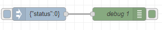
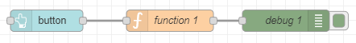

# Node-REDを活用したIoT実習

## MQTTを使って制御する

### データフロー

データフローは下図となる。

<center>
    
</center>

### Subscriberへの通知

`mqtt out` ノードを配置して，トピックに `deviceXX/status` と入力します．このノードに `indject` ノードを接続します．`inject` ノードのpayload は`json` として，それぞれに，{"status": 1 } to 3 を入力します.今回は、Node-RED側がPublisherとなり、トピック  `device01/status` として、0から3のstatusコードに応じてデバイス(ESP32)に接続したLEDの点灯を制御します。

### ダッシュボードの例

次の図は，ESP32に送信するためのボタンを表示したものである。

<center>
    
</center>

## フローの構築

各ノードの設置内容は以下

- MQTT Broker
  - デフォルト

- mqtt out
  
  - server:`localhost:1883`
  - topic:`deviceXX/status`
  - 画像では，`device01/status`となっている。

  msg.topicを`devicexx/status`として、msg.payloadを`{"status":値}`として、ブローカにパブリッシュする。

- inject
  
  msgオブジェクトの構造の`payload`に、JSONデータをinjectノードで生成する。キーには、`status`、値には、`1`を入れる。また、今後LEDを様々な制御するために、`2`や`3`といった適当な値を入れること。

  ```json
  {"status": 1}
  ```

  JSONデータをdebugノードで、msgオブジェクトの全体を表示すると以下のようになる。`mag.payload`には、`{"status":0}`となっている。

  ```js
  {"_msgid":"3fab140f4d257d65","payload":{"status":0}}
  ```

- button
    - Tab：` IoTシステム `
    - グループ：` LED `

- function

  ダッシュボードをボタンをクリックすると、同様にmsgオブジェクトの構造の`payload`に、JSON形式のデータを代入することで、injectノードと同じ仕組みを構成する。

  ```js
  msg.payload = {"status":1}
  return msg;
  ```

- debug
    - デフォルト
  
### `デプロイ` ボタンをクリックしノードを有効化する

## ESP32の構築
### ESP32をSubscriberとして、JSONデータを取得する

次のコードからLEDの点灯プログラムを入力します。JSONデータ構造には、`0`や`1`などの数値が値としてあり、それを`led_status`というグローバル変数にて、`switch文`でLEDの制御パターンを分岐する。

```c++
// ライブラリをインクルード
#include <PubSubClient.h>
#include <ArduinoJson.h>
#include <SparkFunBME280.h>

// WiFi
#include <WiFi.h>
#include <time.h>

// wifi config
#define WIFI_SSID "SSID"
#define WIFI_PASSWORD "PASSWORD"

// MQTT config
#define MQTT_SERVER "node-redサーバのIPアドレス"
#define MQTT_PORT 1883
#define MQTT_BUFFER_SIZE 128
#define TOPIC_STATUS "deviceXX/status"

// デバイスID　デバイスIDは機器ごとにユニークにします
#define DEVICE_ID "esp001"

// BME280
BME280 bme;
BME280_SensorMeasurements measurements;

/* MQTT Subscribe */
// JSONのオブジェクトを点灯、消灯、点滅および余分に4つの項目のため作成
const int request_capacity = JSON_OBJECT_SIZE(4);

// 静的にJSONデータを生成するためにメモリを確保
StaticJsonDocument<request_capacity> json_request;

/* MQTT用インスタンス作成 */
// WiFiClientのクラスからこのプログラムで実際に利用するWiFiClientのオブジェクトをespClientとして作成
WiFiClient espClient;

// Clientからブローカへの通信を行うPublish、ブローカへデータの受信を要求するSubscribeの処理などの、MQTTの通信を行うためのPubsubClientのクラスから実際に処理を行うオブジェクトclientを作成
PubSubClient client(espClient);

// LEDステータス用のlong型変数led_statusを初期値0に指定
unsigned long led_status = 0;

/* MQTT Subscribeのコールバック */
// 受信データを示すtopic、payload、lengthの3項目が呼び出される関数に引数として渡される。
// 受信データの処理をこのCallback関数の中にユーザが記述
/*
topic　：　デバイス間の通信データの識別を行うための階層構造を識別するデータ
payload ：　ブロッカから送られたメッセージ・データ
length　：　メッセージ長
*/
void mqttCallback(char* topic, byte* payload, unsigned int length) {

  // 文字列のpayloadの中身をJSONオブジェクトであるjson_requestにデシリアライズ化（JSON化）
  DeserializationError err = deserializeJson(json_request, payload, length);
  if (err) {
    Serial.println("Deserialize error");
    Serial.println(err.c_str());
    return;
  }

  // JSONデータのキーstatusの値をled_statusに代入
  led_status = json_request["status"];
}

// WiFiへの接続
void setupWiFi() {
  // connect wifi
  WiFi.begin(WIFI_SSID, WIFI_PASSWORD);
  while (WiFi.status() != WL_CONNECTED) {
    Serial.println(".");
    delay(100);
  }

  Serial.println("");
  Serial.print("Connected : ");
  Serial.println(WiFi.localIP());
  // sync Time
  configTime(3600L * 9, 0, "ntp.nict.jp", "ntp.jst.mfeed.ad.jp");

  /* MQTTブローカに接続 */
  // インスタント化したオブジェクトclientの接続先のサーバを、アドレスとポート番号を設定
  client.setServer(MQTT_SERVER, MQTT_PORT);

  /* MQTT subscribeの設定 */
  // Clientは、ブローカ（サーバ）からのメッセージを受信するとmqttCallback関数を呼び出す
  client.setCallback(mqttCallback);
}

void setup() {
  Serial.begin(115200);
  // WiFi接続
  setupWiFi();
}

void loop() {
  client.loop();

  // MQTT未接続の場合は，再接続
  while (!client.connected()) {
    Serial.println("Mqtt Reconnecting");
    if (client.connect(DEVICE_ID)) {
      client.subscribe(TOPIC_STATUS);
      Serial.println("Mqtt Connected");
      break;
    }
    delay(1000);
  }

  switch (led_status) {
    case 0:
      // LED OFF
      break;
    case 1:
      // LED ON
      break;
    default:
      break;
  }
}
```

以上のプログラムをコンパイルし、ESP32に転送を行う

## 動作確認

以下のURL<http://localhost:8080/ui>にアクセスする。

`inject` ノード及びダッシュボードのボタンをクリックしてESP32のLEDの点灯することを確認する。

<center>
    
</center>

injectノードのボタンをクリックするとdebugノードでのmsgオブジェクト全体の構造は以下のようになっている。

```js
{"_msgid":"de7576c98a025b30","payload":{"status":0}}
```

<center>
    
</center>

ダッシュボードのボタンをクリックするとdebugノードでもmsgオブジェクト全体の構造は以下のようになっている。

```js
{"payload":{"status":0},"event":{"clientX":441,"clientY":144,"bbox":[277,173,1243,125]},"socketid":"Z188JdPgZ8hqhLBDAAAB","_msgid":"3d35244e360b8224"}
```

## （課題）LEDを点滅させたりPWM制御したり、LEDの数を増やしたりしてみよう。

