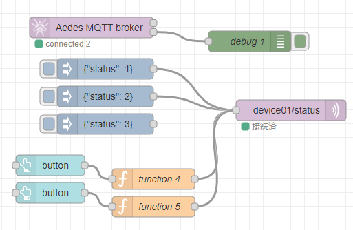
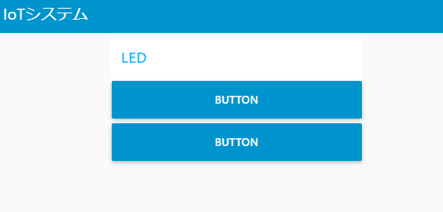

# Node-REDを活用したIoT実習

## MQTTを使う

### データフロー

データフローは下図となる。

<center>
    
</center>

### MQTT Subscribe

MQTTサーバからの情報を処理する．Subscriberの機能を実装することでサーバーからの要求に応じたデバイスの処理を行うことができます．

### Subscriberへの通知

`mqtt out` ノードを配置して，トピックに `deviceXX/status` と入力します．このノードに `indject` ノードを接続します．`inject` ノードのpayload は`json` として，それぞれに，status: 1 to 3 を入力します．

### Subscriberの機能追加

トピック  `device01/status` へ 0から3のstatusコードに応じてデバイス(ESP32)に接続したLEDの点灯を制御します。

### ダッシュボードの例

次の図は，ESP32に送信するためのボタンを表示したものである。

<center>
    
</center>

### 各ノードの設置内容は以下

- MQTT Broker
    - デフォルト

- mqtt out
    - server:`localhost:1883`
    - topic:`deviceXX/status`
      - 画像では，`device01/status`となっている。

- inject
    ```json
    {"status": 1}
    ```

- button
    - Tab：` IoTシステム `
    - グループ：` LED `

- function
  ```js
  msg.payload = {"status":1}
  return msg;
  ```

- debug
    - デフォルト
  
### `デプロイ` ボタンをクリックしノードを有効化する

### Arduino code

次のコードからLEDの点灯プログラムを入力します。

```c
#include <PubSubClient.h>
#include <ArduinoJson.h>
#include <SparkFunBME280.h>

// WiFi
#include <WiFi.h>
#include <time.h>

// wifi config
#define WIFI_SSID "SSID"
#define WIFI_PASSWORD "PASSWORD"

// MQTT config
#define MQTT_SERVER "PCのIPアドレス"
#define MQTT_PORT 1883
#define MQTT_BUFFER_SIZE 128
#define TOPIC_STATUS "deviceXX/status"

// デバイスID　デバイスIDは機器ごとにユニークにします
#define DEVICE_ID "esp001"

// BME280
BME280 bme;
BME280_SensorMeasurements measurements;

// MQTT Subscribe
const int request_capacity = JSON_OBJECT_SIZE(4);
StaticJsonDocument<request_capacity> json_request;

// MQTT用インスタンス作成
WiFiClient espClient;
PubSubClient client(espClient);

// LEDステータス
unsigned long led_status = 0;

// MQTT Subscribeのコールバック
void mqttCallback(char* topic, byte* payload, unsigned int length) {

  DeserializationError err = deserializeJson(json_request, payload, length);
  if (err) {
    Serial.println("Deserialize error");
    Serial.println(err.c_str());
    return;
  }

  serializeJson(json_request, Serial);
  Serial.println("");

  led_status = json_request["status"];
}

// WiFiへの接続
void setupWiFi() {
  // connect wifi
  WiFi.begin(WIFI_SSID, WIFI_PASSWORD);
  while (WiFi.status() != WL_CONNECTED) {
    Serial.println(".");
    delay(100);
  }

  Serial.println("");
  Serial.print("Connected : ");
  Serial.println(WiFi.localIP());
  // sync Time
  configTime(3600L * 9, 0, "ntp.nict.jp", "ntp.jst.mfeed.ad.jp");

  // MQTTブローカに接続
  client.setServer(MQTT_SERVER, MQTT_PORT);

  // MQTT subscribeの設定
  client.setCallback(mqttCallback);
}

void setup() {
  Serial.begin(115200);
  // WiFi接続
  setupWiFi();
}

void loop() {
  client.loop();

  // MQTT未接続の場合は，再接続
  while (!client.connected()) {
    Serial.println("Mqtt Reconnecting");
    if (client.connect(DEVICE_ID)) {
      client.subscribe(TOPIC_STATUS);
      Serial.println("Mqtt Connected");
      break;
    }
    delay(1000);
  }

  switch (led_status) {
    case 0:
      //
      break;
    case 1:
      // LED ON
      break;
    case 2:
      // LED OFF
      break;
    case 3:
      // LED Blink
      break;
    default:
      break;
  }
}
```

Node-RED のFlowをデプロイします． `inject` ノード及びダッシュボードのボタンをクリックしてESP32のLEDの点灯することを確認する。

## （課題）LEDをPWM制御したり、LED以外の物を操作してみよう。例:サーボモータ等
