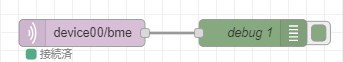

# Node-REDを活用しIoT実習

## Ambientを使う

AmbientはIoTのアイデアをなるべく簡単にプロトタイプするお手伝いをします。細かな初期設定をしなくても送ったデータをリアルタイムでグラフ化します。例えばセンサから得られた温度と湿度のデータを初期設定をしないで送った場合でも、簡単にグラフが表示されます。

### データフロー

データフローは下図となる。

<center>
    
</center>

### ダッシュボードの例

次の図は，ESP32 より送信した データをAmbientのダッシュボードに表示したものである。左のチャートに温湿度のグラフ、右のチャートに気圧のグラフを表示している。

<center>
    
</center>

### Ambientの設定

以下のアドレス<https://ambidata.io/>にアクセスし、Ambientのアカウントを作成する。

- 手順
  
  1. チャンネル一覧＞チャンネルを作る
  <center>
    
  </center>

  2. 設定＞設定変更
  <center>
    
  </center>

  3. チャンネルの設定
      - チェンネル名：`ESP32温湿度気圧データロガー`
      - データ1：`温度`
      - データ2：`湿度`
      - データ3：`気圧`
  <center>
    
  </center>

  4. チャンネル名`ESP32温湿度気圧データロガー`をクリック
  <center>
    
  </center>

  5. チャンネルデータ設定をクリック
  <center>
    
  </center>

  6. データの設定
      - チャート名：`温湿度データ`
      - チャートの種類：`折れ線グラフ`
      - d1:温度：`左軸`
      - d2:湿度：`右軸`
      - 軸の最小最大値：`任意`

  <center>
    
  </center>

## フローの構築

### node-red アンビエント機能

`node-red-contrib-ambient` を利用することでAmbientへのデータ送信を容易にすることができる。

### `node-red-contrib-ambient` ノードの追加

パレットの管理から，ノードを追加を選択して，`node-red-contrib-ambient` を検索し追加を行う

各ノードの設置内容は以下

- MQTT Broker
    - デフォルト

- mqtt in
    - server:`localhost:1883`
    - topic:`deviceXX/bme`
      - 画像では，`device01/bme`となっている。

- function

  msg.payloadのオブジェクトには、`{"temp:xxx", "humid":xxx, "press":xxx}`というJSON形式のデータ構造となっているため、`.(ドット)`でキーを指定することで、値（データ）を参照することができる。ここでは、JSON形式で`{"d1":xxx, "d2":xxx, "d3":xxx}`として変数dataに格納し、その後`msg.payload`に代入している。

  ```js
  var data = {
    "d1": msg.payload.temp,
    "d2": msg.payload.humid,
    "d3": msg.payload.press
  }
  msg.payload = data;
  return msg;
  ```

- Ambient
    - ChannelId及びWriteKey：`自身のID及びキー`

- debug
    - デフォルト

`デプロイ` ボタンをクリックしノードを有効化する

## ESP32をPublisherにして，センサ情報を送信する

以下のコードは，MQTTブローカへBME280センサで取得したデータを送信します．

```c++
// ライブラリをインクルード
#include <PubSubClient.h>
#include <ArduinoJson.h>
#include <SparkFunBME280.h>

// WiFi
#include <WiFi.h>
#include <time.h>

// wifi config
#define WIFI_SSID "SSID" 
#define WIFI_PASSWORD "PASSWORD"

// MQTT config
#define MQTT_SERVER "node-redサーバのIPアドレス"
#define MQTT_PORT 1883
#define MQTT_BUFFER_SIZE 128
#define TOPIC "deviceXX/bme"

// デバイスID　デバイスIDは機器ごとにユニークにします
#define DEVICE_ID "esp001"

// BME280
BME280 bme;
BME280_SensorMeasurements measurements;

// Ticker
#include <Ticker.h>
Ticker tickerMeasure;

/* MQTT Publish */
// JSONのオブジェクトを温度、湿度、気圧用に3つの項目のため作成
const int message_capacity = JSON_OBJECT_SIZE(3);

// 静的にJSONデータを生成するためにメモリを確保
StaticJsonDocument<message_capacity> json_message;

// JSONデータを格納する文字型配列のサイズを128に設定
char message_buffer[MQTT_BUFFER_SIZE];

/* MQTT用インスタンス作成 */
// WiFiClientのクラスからこのプログラムで実際に利用するWiFiClientのオブジェクトをespClientとして作成
WiFiClient espClient;

// Clientからブローカへの通信を行うPublish、ブローカへデータの受信を要求するSubscribeの処理などの、MQTTの通信を行うためのPubsubClientのクラスから実際に処理を行うオブジェクトclientを作成
PubSubClient client(espClient);

// WiFiへの接続
void setupWiFi() {
  // connect wifi
  WiFi.begin(WIFI_SSID, WIFI_PASSWORD);
  while (WiFi.status() != WL_CONNECTED) {
    Serial.println(".");
    delay(100);
  }

  Serial.println("");
  Serial.print("Connected : ");
  Serial.println(WiFi.localIP());
  // sync Time
  configTime( 3600L * 9, 0, "ntp.nict.jp", "ntp.jst.mfeed.ad.jp");

  /* MQTTブローカに接続 */
  // インスタント化したオブジェクトclientの接続先のサーバを、アドレスとポート番号を設定
  client.setServer(MQTT_SERVER, MQTT_PORT);

  // 1sごとにセンサデータを取得
  tickerMeasure.attach_ms(1000, sendSensorData);
}

void sendSensorData(void) {
  //センサからデータの取得
  bme.readAllMeasurements(&measurements);

  // シリアルモニタにセンサデータを表示
  Serial.println("Humidity,Pressure,BME-Temp");
  Serial.print(measurements.humidity, 0);
  Serial.print(",");
  Serial.print(measurements.pressure / 100, 2);
  Serial.print(",");
  Serial.println(measurements.temperature, 2);
}

void setup() {
  Serial.begin(115200);

  Wire.begin();

  if (bme.beginI2C() == false) //Begin communication over I2C
  {
    Serial.println("The sensor did not respond. Please check wiring.");
    while (1); //Freeze
  }

  // WiFi接続
  setupWiFi();
}

void loop() {
  client.loop();

  // MQTT未接続の場合は，再接続
  while (!client.connected() ) {
    Serial.println("Mqtt Reconnecting");
    if ( client.connect(DEVICE_ID) ) {
      Serial.println("Mqtt Connected");
      break;
    }
  }

  /* ペイロードを作成して送信を行う．*/
  // JSONデータをクリア
  json_message.clear();

  // JSONの項目をキーと値を添えてJSONを作成
  json_message["humid"] = measurements.humidity;
  json_message["press"] = measurements.pressure / 100;
  json_message["temp"] = measurements.temperature;

  // json_messageの中のJSONデータをJSON形式の文字列message_bufferとしてシリアライズ化（文字列に変換）
  serializeJson(json_message, message_buffer, sizeof(message_buffer));

  // トピックをdevicexx/bmeして、JSON形式の文字列をパブリッシュする
  client.publish(TOPIC, message_buffer);
  delay(5000);
}
```

プログラムをコンパイルし、ESP32に転送を行う
## 動作確認

Arduino IDEのシリアルモニタで起動およびデータ取得の確認する．

<center>
  
</center>

MQTT inノードに接続されたdebugノードで、msgオブジェクトの全体を表示すると以下のような構成になっている。`topic`には、`"devicexx/bmm"`という文字型データ、`payload`には、`{}`で囲まれたJSONデータで構成されている。

```json
{"topic":"device00/bme","payload":{"humid":34.49023438,"press":1002.278992,"temp":25.12999916},"qos":0,"retain":false,"_topic":"device00/bme","_msgid":"dac087ca3ee99498"}
```

さらに、Fuctionノードに接続されたdebugノードで、msgオブジェクトの全体を表示すると、`msg.payload`の中身が、`{"d1":24.88999939,"d2":33.609375,"d3":1002.606628}`になっていることが確認できる。

```json
{"topic":"device00/bme","payload":{"d1":24.88999939,"d2":33.609375,"d3":1002.606628},"qos":0,"retain":false,"_topic":"device00/bme","_msgid":"455cc565d8af7756"}
```

Ambientのダッシュボードにアクセスし、データが送信されていることを確認する。

## （課題）気圧データもグラフにしてみよう

## （課題）複数の端末(ESP32)から、センサデータを収集しよう

d3,d4,d5と、送信用のキーに設定し、Ambient上のダッシュボードでチャート表示してみる。