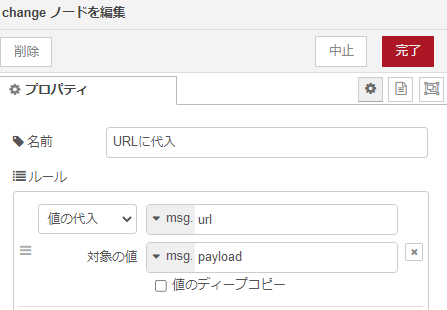
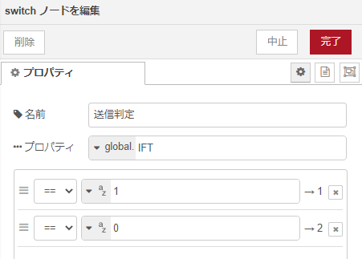
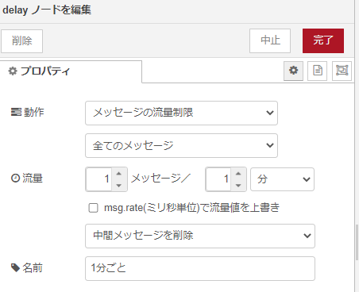

# Node-REDを活用しIoT実習

## IoTプロトタイプを作ろう

### データフロー

データフローは下図となる。

<center>
  
</center>

### ダッシュボードの例

次の図は，ESP32 より送信した データをダッシュボードに表示したものである。

<center>
    
</center>

### IFTTTの設定

以下のアドレスにアクセス

  - <https://ifttt.com/explore>

- 手順
    - `Create`をクリック
    <center>
        
    </center>

    - `IF This`のAddをクリックし、`webohok`を選択
    <center>
        
    </center>

    - Receive a web requestを選択し、Event Nameを`iot_data`にし、Create triggerをクリック

    - `Then That`のAddをクリックし、`google sheetsを選択`
    - `Add row to spredsheet`を選択し、以下の図と同様にする。
    <center>
        
    </center>

    - Create actionをクリック

    - `Continue`をクリック
    <center>
        
    </center>

    - `Webhooks`のアイコンをクリックし、`Documentation`をクリック
    <center>
        
    </center>

    - `{{event}}`に`iot_data`を入れ、以下のURLをコピーする。
    <center>
        
    </center>

### 各ノードの設置内容は以下

- MQTT Broker
    - デフォルト

- mqtt in
    - server:`localhost:1883`
    - topic:`deviceXX/bme`
        - 画像では，`device01/bme`となっている。

- change
    - 名前：`気圧の取り出し（温度、湿度）`
    <center>
        
    </center>

    - 名前：`URLに代入`
    <center>
        
    </center>

    - 名前：`送信判定`
    <center>
        
    </center>

    - 名前：`送信中`
    <center>
        
    </center>

    - 名前：`停止中`
    <center>
        
    </center>

- gauge
    - Tab：` データロガー `
    - グループ：` 気象情報 `
    - ラベル：` 気圧（温度、湿度） `

- chart
    - Tab：` データロガー `
    - グループ：` 気象情報 `

- delay
    - 名前：`1分ごと`
    <center>
        
    </center>

- function
    - 名前：` URLを生成 `
        - コード
        ```js
        var data = msg.payload;
        var data1 = data.humid;
        var data2 = data.temp;
        var data3 = data.press;
        var payload = "https://maker.ifttt.com/trigger/iot_data/with/key/`xxxxxxxxxxx`?value1="
        payload += data1;
        payload += "&value2=";
        payload += data2;
        payload += "&value3=";
        payload += data3;
        msg.payload = payload;
        return msg;
        ```

    - 名前：`IFTフラグセット`
        - コード
        ```js
        global.set("IFT", 1);
        return msg;
        ```

    - 名前：`IFTフラグリセット`
        - コード
        ```js
        global.set("IFT", 0);
        return msg;
        ```

- http request
    - デフォルト

- button
    - Lavel：`IFTTT送信開始（IFTTT送信終了）`
    <center>
        
    </center>

- text
    - Lavel：`IFTTT送信制御`
    <center>
        
    </center>

- debug
    - デフォルト

`デプロイ` ボタンをクリックしノードを有効化する

以下のURL<http://localhost:8080/ui>にアクセスする。

Google Driveを確認する。

## （課題）観測データをできるだけ集めてスプレッドシートにて、グラフを作成しよう。
