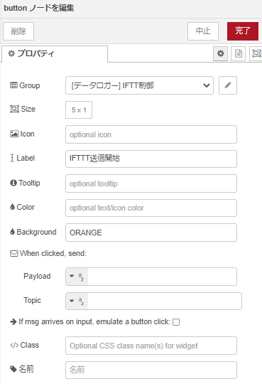

# Node-REDを活用しIoT実習

## IoTシステムのプロトタイプを作ろう

今回製作するIoTシステムのプロトタイプは、4つの部で構成されている。
1. MQTTでESP32から送られてきたセンサデータをNode-RED上のダッシュボードで、チャートかつゲージに表示

2. 1分毎に、観測した温湿度・気圧データをDBに格納

3. 1分毎に、観測した温湿度・気圧データをIFTTTを介して、Googleスプレッドシートに送信

4. ESP32に取り付けられたLEDをダッシュボード上のUIボタンで(点灯/消灯/点滅)の制御およびLEDの稼働状況を可視化

### データフロー

データフローは下図となる。

<center>
  
</center>

### ダッシュボードの例

次の図は，ESP32 より送信した データをダッシュボードに表示したものである。

<center>
    
</center>

次の図は、今回作成するダッシュボードのレイアウト図である。

<center>
    
</center>

### IFTTTの設定

以下のアドレス<https://ifttt.com/explore>にアクセス

- 手順
    1. `Create`をクリック
    <center>
        
    </center>

    2. `IF This`のAddをクリックし、`webohok`を選択
    <center>
        
    </center>

    3. Receive a web requestを選択し、Event Nameを`iot_data`にし、Create triggerをクリック

    4. `Then That`のAddをクリックし、`google sheetsを選択`

    5. `Add row to spredsheet`を選択し、以下の図と同様にする。

    <center>
        
    </center>

    6. Create actionをクリック

    7. `Continue`をクリック
    <center>
        
    </center>

    8. `Webhooks`のアイコンをクリックし、`Documentation`をクリック

    <center>
        
    </center>

    9. `{{event}}`に`iot_data`を入れ、以下のURLをコピーしておく。
    <center>
        
    </center>

## フローの構築

### `node-red-contrib-ui-led` ノードの追加

パレットの管理から，ノードを追加を選択して，`node-red-contrib-ui-led` を検索し追加を行う

### `node-red-contrib-ui-state-trail` ノードの追加

パレットの管理から，ノードを追加を選択して，`node-red-contrib-ui-state-trail` を検索し追加を行う

各ノードの設置内容は以下

#### ①のフロー

- MQTT Broker
    - デフォルト

- mqtt in
    - server:`localhost:1883`
    - topic:`deviceXX/bme`
        - 画像では，`device00/bme`となっている。

- change

    msg.payloadオブジェクトの`press`を取り出し、`mag.payload`に代入する。

    - 名前：`気圧の取り出し（温度、湿度）`
    <center>
        
    </center>

- gauge
    - Tab：` データロガー `
    - グループ：` 気象情報 `
    - Type：`気圧/Donut, 温度/Gauge, 湿度/Lavel`
    - Units：`hPa, ℃, %`
    - ラベル：` 気圧(温度、湿度)`

    <center>
        
    </center>

- chart
    - Tab：` データロガー `
    - グループ：` 気象情報 `

- button
    - Tab：` データロガー `
    - グループ：` 気象情報 `
    - Lavel：`データクリア`

    <center>
        
    </center>

- function

    - 名前：チャート用空データを作成
    ```js
    msg.payload = []
    return msg;
    ```

    - 名前：グローバル変数に変換(気圧)
    ```js
    global.set("p_data", msg.payload);
    return msg;
    ```

    - 名前：グローバル変数に変換(温度)
    ```js
    global.set("t_data", msg.payload);
    return msg;
    ```

    - 名前：グローバル変数に変換(湿度)
    ```js
    global.set("h_data", msg.payload);
    return msg;
    ```

#### ②のフロー

- inject
    - 名前：テーブル作成
    - msg.topic =
    ```db
    CREATE TABLE sensordata (time string, temp INTEGER, humid INTEGER, press INTEGER);
    ```

    - 名前：テーブル削除
    - msg.topic =
    ```db
    DROP TABLE sensordata;
    ```

    - 名前：1分毎に更新
    <center>
        
    </center>

- sqlite
    - 名前：`DB`
    <center>
        
    </center>

- function
    - 名前：データ格納
    ```js
    //グローバル変数をローカル変数に代入
    var temp = global.get('t_data');
    var press = global.get('p_data');
    var humid = global.get('h_data');
    //時間を取得し、hh:mm:ssの形に変換
    var dt = new Date();
    var time = dt.getHours() + ':' + dt.getMinutes() + ':' + dt.getSeconds();

    msg.topic = "INSERT INTO sensordata VALUES ('" + time + "'," + temp + "," + humid + "," + press + ");";

    return msg;
    ```

#### ③のフロー

- inject
    - 名前：1分毎に更新
    <center>
        
    </center>

- function

    GETパラメータ（GET parameter）とは、クライアント側(Webアプリケーション)がWebサーバ側に送信するデータをURLの末尾に特定の形式で表示したものです。リクエストパラメータ（request parameter）ともいう。URLの末尾に「?」マークを付け、続けて「名前=値」の形式で記述されています。値が複数あるときは「&」で区切られています。

    - 名前：データ格納
    ```js
    //グローバル変数をローカル変数に代入
    var data1 = global.get('h_data');
    var data2 = global.get('t_data');
    var data3 = global.get('p_data');
    //ifttt用アドレス(ｘｘｘｘｘの箇所を変更)
    var url = "https://maker.ifttt.com/trigger/iot_data/with/key/ｘｘｘｘｘ"

    //各valueとデータ値を紐づけ送信するためのパラメータ作成
    url += "?value1=";
    url += data1;
    url += "&value2=";
    url += data2;
    url += "&value3=";
    url += data3;

    msg.payload = url;
    return msg;
    ```

    - 名前：フラグセット
    ```js
    global.set("IFT", 1);
    return msg;
    ```

    - 名前：フラグリセット
    ```js
    global.set("IFT", 0);
    return msg;
    ```

- change
    - 名前：URLに代入
    <center>
        
    </center>

    - 名前：`送信中`
    <center>
        
    </center>

    - 名前：`停止中`
    <center>
        
    </center>

- switch
    - 名前：送信判定
    - プロパティ：`global.IFT`
    <center>
        
    </center>

- http request
    - メソッド：`GET`

    ※switchノードには、上側のコネクタに接続

- button
    - Tab：` データロガー `
    - グループ：` IFTTT制御 `
    - Lavel：`IFTTT送信開始/IFTTT送信終了`
    <center>
        
    </center>

- text
    - Tab：` データロガー `
    - グループ：` IFTTT制御 `
    - Lavel：`IFTTT送信制御`
    <center>
        
    </center>

#### ④のフロー

- mqtt out
  - server:`localhost:1883`
  - topic:`deviceXX/status`
  - 画像では，`device00/status`となっている。

msg.topicを`devicexx/status`として、msg.payloadを`{"status":値}`として、ブローカにパブリッシュする。

- button
    - Tab：` データロガー `
    - グループ：`LED制御`  
    - Lavel：各`ON/OFF/Blink`
    <center>
        
    </center>

- function
    - 名前：LED点灯
    ```js
    msg.payload = { "status": 1 }
    return msg;
    ```

    - 名前：LED消灯
    ```js
    msg.payload = { "status": 0 }
    return msg;
    ```

    - 名前：LED点滅
    ```js
    msg.payload = { "status": 2 }
    return msg;
    ```

    - データの生成
    ```js    
    var time = new Date();
    var localTime = time.getTime();

    if (msg.payload.status == 0) {
    msg.payload = { state: "stop", timestamp: localTime };
    } else if (msg.payload.status == 1) {
    msg.payload = { state: "run", timestamp: localTime };
    } else if (msg.payload.status == 2) {
    msg.payload = { state: "alarm", timestamp: localTime };
    }
    return msg;
    ```

- led
    - Tab：` データロガー `
    - グループ：`LED状態`  
    - ラベル：LED状態確認
    <center>
        
    </center>

- state-trail
    - Tab：` データロガー `
    - グループ：`LED状態`
    <center>
        
    </center>

#### 共通のフロー

- debug
    - デフォルト


`デプロイ` ボタンをクリックしノードを有効化する

### ESP32の設定

1. ESP32をPublisherにして，センサ情報を送信する。
2. ESP32をSubscriberとして、JSONデータを取得する

```c++
// ライブラリをインクルード
#include <PubSubClient.h>
#include <ArduinoJson.h>
#include <SparkFunBME280.h>

// WiFi
#include <WiFi.h>
#include <time.h>

// wifi config
#define WIFI_SSID "SSID"
#define WIFI_PASSWORD "PASSWORD"

// MQTT config
#define MQTT_SERVER "node-redサーバのIPアドレス"
#define MQTT_PORT 1883
#define MQTT_BUFFER_SIZE 128
#define TOPIC "deviceXX/bme"
#define TOPIC_STATUS "deviceXX/status"

// デバイスID　デバイスIDは機器ごとにユニークにします
#define DEVICE_ID "esp001"

// BME280
BME280 bme;
BME280_SensorMeasurements measurements;

// Ticker
#include <Ticker.h>
Ticker tickerMeasure;

/* MQTT Publish */
// JSONのオブジェクトを温度、湿度、気圧用に3つの項目のため作成
const int message_capacity = JSON_OBJECT_SIZE(3);

/* MQTT Subscribe */
// JSONのオブジェクトを点灯、消灯、点滅および余分に4つの項目のため作成
const int request_capacity = JSON_OBJECT_SIZE(4);

// 静的にJSONデータを生成するためにメモリを確保
StaticJsonDocument<message_capacity> json_message;

// 静的にJSONデータを生成するためにメモリを確保
StaticJsonDocument<request_capacity> json_request;

// JSONデータを格納する文字型配列のサイズを128に設定
char message_buffer[MQTT_BUFFER_SIZE];

/* MQTT用インスタンス作成 */
// WiFiClientのクラスからこのプログラムで実際に利用するWiFiClientのオブジェクトをespClientとして作成
WiFiClient espClient;

// Clientからブローカへの通信を行うPublish、ブローカへデータの受信を要求するSubscribeの処理などの、MQTTの通信を行うためのPubsubClientのクラスから実際に処理を行うオブジェクトclientを作成
PubSubClient client(espClient);

// LEDステータス用のlong型変数led_statusを初期値0に指定
unsigned long led_status = 0;

/* MQTT Subscribeのコールバック */
// 受信データを示すtopic、payload、lengthの3項目が呼び出される関数に引数として渡される。
// 受信データの処理をこのCallback関数の中にユーザが記述
/*
topic　：　デバイス間の通信データの識別を行うための階層構造を識別するデータ
payload ：　ブロッカから送られたメッセージ・データ
length　：　メッセージ長
*/
void mqttCallback(char* topic, byte* payload, unsigned int length) {

  // 文字列のpayloadの中身をJSONオブジェクトであるjson_requestにデシリアライズ化（JSON化）
  DeserializationError err = deserializeJson(json_request, payload, length);
  if (err) {
    Serial.println("Deserialize error");
    Serial.println(err.c_str());
    return;
  }

  // JSONデータのキーstatusの値をled_statusに代入
  led_status = json_request["status"];
}

// WiFiへの接続
void setupWiFi() {
  // connect wifi
  WiFi.begin(WIFI_SSID, WIFI_PASSWORD);
  while (WiFi.status() != WL_CONNECTED) {
    Serial.println(".");
    delay(100);
  }

  Serial.println("");
  Serial.print("Connected : ");
  Serial.println(WiFi.localIP());
  // sync Time
  configTime(3600L * 9, 0, "ntp.nict.jp", "ntp.jst.mfeed.ad.jp");

  /* MQTTブローカに接続 */
  // インスタント化したオブジェクトclientの接続先のサーバを、アドレスとポート番号を設定
  client.setServer(MQTT_SERVER, MQTT_PORT);

  // 5sごとにセンサデータを取得
  tickerMeasure.attach_ms(5000, sendSensorData);

  /* MQTT subscribeの設定 */
  // Clientは、ブローカ（サーバ）からのメッセージを受信するとmqttCallback関数を呼び出す
  client.setCallback(mqttCallback);
}

void sendSensorData(void) {
  // シリアルモニタにセンサデータを表示
  Serial.println("Humidity,Pressure,BME-Temp");
  Serial.print(measurements.humidity, 2);
  Serial.print(",");
  Serial.print(measurements.pressure / 100, 2);
  Serial.print(",");
  Serial.println(measurements.temperature, 2);

  /* ペイロードを作成して送信を行う　*/
  // JSONデータをクリア
  json_message.clear();

  // JSONの項目をキーと値を添えてJSONを作成
  json_message["humid"] = measurements.humidity;
  json_message["press"] = measurements.pressure / 100;
  json_message["temp"] = measurements.temperature;

  // json_messageの中のJSONデータをJSON形式の文字列message_bufferとしてシリアライズ化（文字列に変換）
  serializeJson(json_message, message_buffer, sizeof(message_buffer));

  // トピックをdevicexx/bmeして、JSON形式の文字列をパブリッシュする
  client.publish(TOPIC, message_buffer);
}

void setup() {
  Serial.begin(115200);

  Wire.begin();
  bme.setI2CAddress(0x76);  // I2C address {0x76 or 0x77}
  if (bme.beginI2C() == false)  //Begin communication over I2C
  {
    Serial.println("The sensor did not respond. Please check wiring.");
    while (1);  //Freeze
  }

  // WiFi接続
  setupWiFi();
}

void loop() {
  client.loop();
  
  //センサからデータの取得
  bme.readAllMeasurements(&measurements);
  
  // MQTT未接続の場合は，再接続
  while (!client.connected()) {
    Serial.println("Mqtt Reconnecting");
    if (client.connect(DEVICE_ID)) {
      client.subscribe(TOPIC_STATUS);
      Serial.println("Mqtt Connected");
      break;
    }
    delay(1000);
  }

  switch (led_status) {
    case 0:
    // LED OFF
      break;
    case 1:
    // LED ON
      break;
    case 2:
    // LED BLINK
    default:
      break;
  }
}
```

プログラムをコンパイルし、ESP32に転送を行う

### 動作確認

1. Arduino IDEのシリアルモニタで起動およびデータ取得の確認する．

2. 以下のURL<http://localhost:8080/ui>にアクセスする。

    - ゲージ及びチャートが変化しているか確認
    - データクリアボタンでチャートの履歴が削除
    - LED制御ボタンで`ON/OFF/BLINK`が可能
    - グループ名LED状態のLEDとガントチャートが連動

3. GoogleスプレッドシートまたはGoogle Driveを確認する。

    - IFTTT送信開始ボタンを押す
    - スプレッドシートにデータが送られていることを確認
    - IFTTT送信停止ボタンを押す
    - スプレッドシートにデータが送られなくなることを確認

## （課題）観測データをできるだけ集めてスプレッドシートにて、グラフを作成しよう

<center>
    
</center>

## （課題）DB Browser for SQLiteを使って、データベースを確認してみよう

DB Browser for SQLite(旧：SQLite Database Browser)は SQLite のデータベースを GUI で管理することができるツールのこと

- DB Browser for SQLiteの[ダウンロード](https://download.sqlitebrowser.org/DB.Browser.for.SQLite-3.12.2-win64.msi)

<center>
    
</center>

- 簡単な手順
    1. `データベースを開く`ボタンをクリック

    2. `C:\Users\user\Documents\nodered_docker\backup_data\environment.db`を開く

    3. 上記タブを`データ閲覧`に切り替え
